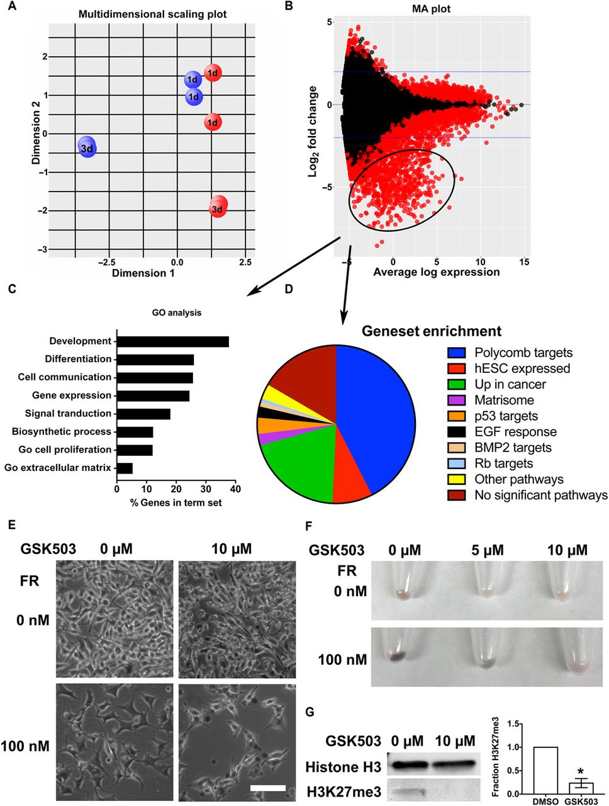
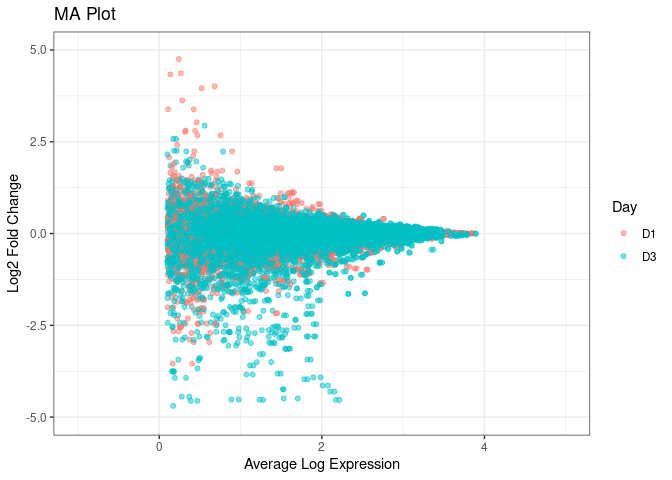

## Introduction

Uveal melanoma (UM) is the most common intraocular cancer afflicting 7
in 1,000,000 individuals in the U.S and UK. 90% of uveal melanoma cases
have mutations in the GNAQ/11 genes. These genes encode for G-protein
coupled receptor (GPCR) subunits found within the inner leaflet of the
plasma membrane that act as an on/off switch for a wide range of
cellular processes. Mutations in the GNAQ/GNA11 genes lead to
constitutively active GPCRs, which causes increased cell growth and
proliferation. In the paper referenced below the authors demonstrate
that FR900359 (FR) prevents GDP/GTP exchange in GRPCs; a crucial step in
signal transduction, via small molecule allosteric inhibition.
Inactivation of the primary mutated pathway found in most UM cases leads
to arrest of cell proliferation, inhibition of secondary signaling, and
reinstated melanocyte differentiation leading to potential therapeutic
uses.

In this report I plan to reproduce the MA plot in Fig.6 B from Onken et
al. 2018 with RNA expression data published with the paper. This figure
depicts the fold change vs. average log expression of RNA between FR and
non FR treated cells. Identification of gene clusters suppressed by FR,
or not, helps us determine FR's downstream effects.

# Reference

Onken MD, Makepeace CM, Kaltenbronn KM, et al. Targeting nucleotide
exchange to inhibit constitutively active G protein α subunits in cancer
cells. Science Signaling. 2018;11(546):eaao6852.
<doi:10.1126/scisignal.aao6852>



Fig. 6. FR represses expression of differentiation genes by restoring
function of the PRC2. (A)Gaq-mutant 92.1 UM cells were treated with FR
or vehicle, and RNA was collected 1 and 3 days (1d and 3d, respectively)
after treatment for RNAseq analysis. Results of a multidimensional gene
expression analysis that compares the relative patterns of expression of
all genes across all samples and groups genes with similar patterns. The
graph shows samples positioned by their relative gene expression values
within each pattern. Dimension 1 (x axis; the most represented pattern)
shows separation based on vehicle treatment (red balls) versus FR
treatment (blue balls), whereas dimension 2 (y axis; the second most
represented pattern) shows separation based on time in culture
(indicated by 1d or 3d on balls). (B)MA plot (M, log ratio; A, mean
average) comparing gene expression between FR- and vehicle-treated 92.1
samples identifies a group of significantly reduced genes (circled; fold
change, \>2; FDR, q \<0.01) associated with FR treatment. (C) GO
analysis of the FR-repressed gene set \[circled in (B) with arrow\]. (D)
FR-repressed genes \[circled in (B) with arrow\] identified as targets
of the polycomb repressive complex2(PRC2)byGSEA.EGF,epidermalgrowth
factor; BMP2, bone morphogenetic protein; hESC, human embryonic stem
cells. (E) Effect of the EZH1/2 inhibitor GSK503 on morphological
differentiation elicited by FR. Representative fields are shown from one
of three experiments of 92.1 UM cells treated for 7 days with GSK503 and
for 3 days with FR and then imaged by phase-contrast microscopy. Scale
bar, 100 μm. (F) Effect of GSK503 on pigmentation of FR-treated cells,
visualized by macroscopic inspection. 92.1 cells were treated for 7 days
with GSK503 and for 3 days with FR and pelleted; representative images
from one of three experiments. (G) PRC2 inhibition by GSK503.
Immunoblots of 92.1 cells treated for 7 days with GSK503 show reduced
histone H3K27 trimethylation. Plot shows relative fraction of
trimethyl-histone H3K27 compared to dimethyl sulfoxide (DMSO) control
and normalized to total histone H3 from densitometry data from three
independent experiments. \*P \< 0.01 by t test; significance was
confirmed using q \< 0.01 by the FDR method of Benjamini and Hochberg.

# Materials and Methods

To collect the data seen in Figure 6 B the authors grew cells in 100 nM
FR or DMSO in RPMI growth medium. After 1 and 3 days of treatment RNA
was collected from each treatment. HiSeq2500 was used to generate FastQ
raw data. This data was aligned to the whole genome using Bioconductor
in EdgeR. Once aligned, a 2.0 fold change in expression was considered
significant comparing FR treated to non-FR treated cells. This data was
then plotted as an MA plot, M = log ratio and A = mean average.

I used the expression data from the CSV files published by the authors
to calculate the average mean expression and the log2 fold change. The
data was combined into a single data table and filtered following the
authors example; fold change \<2 and average expression \<0.1 were
discarded. These values were then plotted using ggplot.

# Results and Discussion



The results generated in the figure indicate that treatment with FR
reduces RNA expression in some genes after 72 hours of treatment. There
is a cluster of genes seen in the bottom left corner that seem to be
down regulated via GNAQ/11 nucleotide exchange inhibition.\
For my own research this project was valuable to confirm some data we
had already seen in our SB mutagenesis assays. This assay identified
several drug resistance drivers, or hot spots for oncogenesis. These
drivers are not seen in the genes that are down regulated by FR which
indicates they can still play a role in drug resistance.

Comparing the figure I generated to the original figure there is a
difference in maximum values. I used the same log transformations and
data trimming as the authors but I failed to see expression values as
high as the authors. It seems almost as if the authors had more data
points on the original image. This is rather unlikely because I
downloaded each replicate mentioned in their materials and methods. The
discrepancy may be due to the fact that I filtered out average
expressions less than 10% from the data given in the CSV files rather
than using statistical analysis on the actual reads.

# Conclusion

In the future I think it will be easier to generate an MA plot from my
own data. Downloading the CSV files from the Gene Expression Omnibus was
easy but I found it difficult to determine what the values given in the
CSV file actually were. It would be nice if the authors provided a
secondary file or added formatting information to the website blurb.
Overall I give the authors an A on reproducibility. They provided
extensive documentation in the articles material and methods section,
used widely available open source software for their analysis, and
participated in open data sharing via the Gene expression Omnibus. The
steps the authors took to insure reproducibility made it far easier for
a beginner like me to recreate these meaningful results.

# Reflection

I learned pretty quickly in this project that it's easier to not
reinvent the wheel. I feel like I picked up at a weird starting point,
as single value gene expression in a CSV, whereas a lot of tutorials I
found online are explaining the entire differential gene expression
pipeline. I look forward to being able to start at square one with the
RNA seq data we generated last month with all of the resources I now
know about, thanks to this project. Another thing I took away from this
project is directory management. I have a lot of images and replicates
of images in my day to day work and I think I'd be completely lost
without a solid foundation in directory structure.

Here is a link to the [Project Github
page](https://github.com/Intro-Sci-Comp-UIowa/biol-4386-course-project-and04304.git)

``` r
#Install needed packages 
options(repos = c(CRAN = "https://cran.r-project.org"))
install.packages('R.utils')
library(data.table)
install.packages("tidyverse")
library(tidyverse)
```

``` r
#Import data files 
GSM2781365_sample.92.1_d1_1.txt <- fread("~/CompSci/Data/GSM2781365_sample.92.1_d1_1.txt.gz")
GSM2781367_sample.92.1_d3_1.txt <- fread("~/CompSci/Data/GSM2781367_sample.92.1_d3_1.txt.gz")
GSM2781369_sample.92.1_fr1_1.txt <- fread("~/CompSci/Data/GSM2781369_sample.92.1_fr1_1.txt.gz")
GSM2781371_sample.92.1_fr3_1.txt <- fread("~/CompSci/Data/GSM2781371_sample.92.1_fr3_1.txt.gz")
GSM2781366_sample.92.1_d1_2.txt <- fread("~/CompSci/Data/GSM2781366_sample.92.1_d1_2.txt.gz")
GSM2781368_sample.92.1_d3_2.txt <- fread("~/CompSci/Data/GSM2781368_sample.92.1_d3_2.txt.gz")
GSM2781370_sample.92.1_fr1_2.txt <- fread("~/CompSci/Data/GSM2781370_sample.92.1_fr1_2.txt.gz")
GSM2781372_sample.92.1_fr3_2.txt <- fread("~/CompSci/Data/GSM2781372_sample.92.1_fr3_2.txt.gz")
```

``` r
#Renames files 
d1 <- GSM2781365_sample.92.1_d1_1.txt[-1,]
d3 <- GSM2781367_sample.92.1_d3_1.txt[-1,]
d1_FR <- GSM2781369_sample.92.1_fr1_1.txt[-1,]
d3_FR <- GSM2781371_sample.92.1_fr3_1.txt[-1,]
d1_2 <- GSM2781366_sample.92.1_d1_2.txt[-1,]
d3_2 <- GSM2781368_sample.92.1_d3_2.txt[-1,]
d1_FR_2 <- GSM2781370_sample.92.1_fr1_2.txt[-1,]
d3_FR_2 <- GSM2781372_sample.92.1_fr3_2.txt[-1,]
```

``` r
# Create a new data table from columns in other tables
expression_data_d1 <- data.frame("Gene Name" = d1$V3,
                              "D1_Expression" = d1$V7,
                              "D1_FR_Expression" = d1_FR$V7)
expression_data_d3 <- data.frame("Gene Name" = d1$V3,
                                 "D3_Expression" = d3$V7,
                                 "D3_FR_Expression" = d3_FR$V7)
data <- data.frame("D1_Expression" = d1$"sample.92.1_d1_1",
                   "D1_FR_Expression" = d1_FR$"sample.92.1_fr1_1",
                   "D3_Expression" = d3$"sample.92.1_d3_1",
                   "D3_FR_Expression" = d3_FR$"sample.92.1_fr3_1",
                   "D1_Expression_2" = d1_2$"sample.92.1_d1_2",
                   "D1_FR_Expression_2" = d1_FR_2$"sample.92.1_fr1_2",
                   "D3_Expression_2" = d3_2$"sample.92.1_d3_2",
                   "D3_FR_Expression_2" = d3_FR_2$"sample.92.1_fr3_2")
```

``` r
# Calculate the mean expression level (M) and the log fold change (A) for each gene
logFC_D1 <- log2(data$D1_FR_Expression / data$D1_Expression)
aveExpr_D1 <- log2(rowMeans(data[,c("D1_FR_Expression","D1_Expression")], na.rm = TRUE))
logFC_D3 <- log2(data$D3_FR_Expression / data$D3_Expression)
aveExpr_D3 <- log2(rowMeans(data[,c("D3_FR_Expression","D3_Expression")], na.rm = TRUE))
logFC_D1_2 <- log2(data$D1_FR_Expression / data$D1_Expression)
aveExpr_D1_2 <- log2(rowMeans(data[,c("D1_FR_Expression_2","D1_Expression_2")], na.rm = TRUE))
logFC_D3_2 <- log2(data$D3_FR_Expression / data$D3_Expression)
aveExpr_D3_2 <- log2(rowMeans(data[,c("D3_FR_Expression_2","D3_Expression_2")], na.rm = TRUE))
# Combine the M and A values with the Day column in a data frame
MA_data <- data.frame(Day = rep(c("D1", "D3"), each = length(logFC_D1)),
                      logFC = c(logFC_D1, logFC_D3, logFC_D1_2, logFC_D3_2 ),
                      aveExpr = c(aveExpr_D1, aveExpr_D3, aveExpr_D1_2, aveExpr_D3_2))
#Filter log fold change>2
MAdata_filtered <- subset(MA_data, logFC >= 2  | logFC <= -2)

#Filtere out low expression
MAdata_filtered <- subset(MA_data, aveExpr >= 0.1)

# Create the MA plot
ggplot(MAdata_filtered, aes(x = aveExpr, y = logFC, color = Day)) +
  geom_point(alpha = 0.5) +
  ggtitle("MA Plot") +
  xlab("Average Log Expression") +
  ylab("Log2 Fold Change") +
  theme_bw()+
  xlim(-1, 5) +
  ylim(-5, 5)
```


